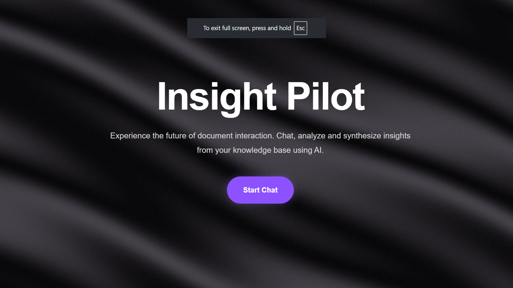
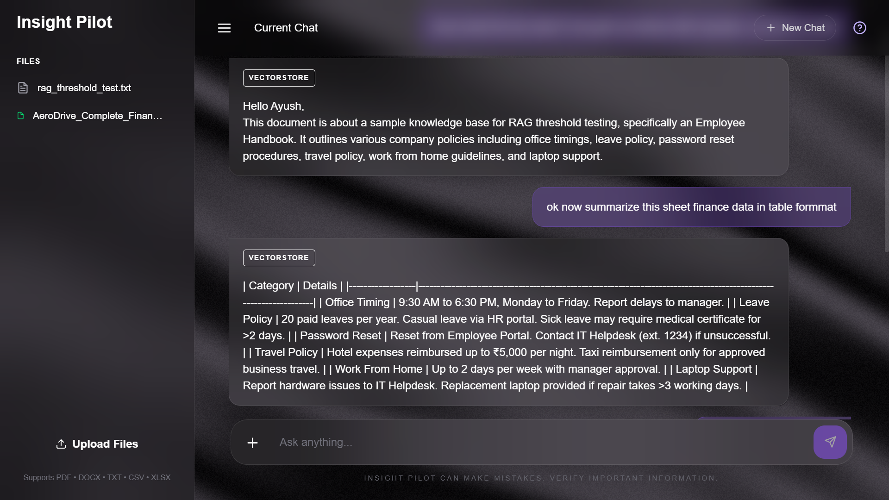
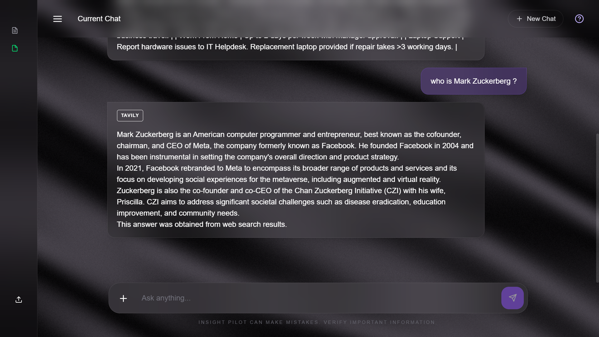

# 🚀 Insight Pilot

An Enterprise-grade AI-powered RAG (Retrieval-Augmented Generation) chatbot that enables users to interact with uploaded documents and structured datasets using natural language.

The application intelligently routes user queries through Vector Search, SQL Querying, or Web Search to provide accurate and context-aware responses.

---


The chatbot answering organization-specific questions.




## ✨ Features

- 📄 Upload multiple document formats
  - PDF
  - DOCX
  - TXT
  - CSV
  - XLSX

- 💬 Natural language chat interface

- 🧠 Intelligent query routing
  - Vector Search (Documents)
  - SQL Query (CSV/Excel)
  - Web Search (Fallback)

- 🔍 Semantic Search using ChromaDB

- 📊 Automatic SQL generation for tabular data

- 🌐 Optional Web Search using Tavily

- ⚡ FastAPI backend

- 🎨 Modern React frontend

- 🔐 Session-based architecture

- 🧹 Automatic cleanup of expired sessions

- 📱 Responsive UI

---

# 🏗️ Architecture

```
                        User
                          │
                          ▼
                   React Frontend
                          │
                          ▼
                    FastAPI Backend
                          │
          ┌───────────────┼───────────────┐
          ▼               ▼               ▼
     ChromaDB         SQLite DB      Tavily Search
          │               │               │
          └───────────────┼───────────────┘
                          ▼
                    Gemini LLM
                          │
                          ▼
                     Final Response
```

---

# 📂 Project Structure

```
Insight-Pilot/

├── api/
├── config/
├── database/
├── models/
├── services/
├── uploads/
├── utils/
├── frontend/
├── app.py
├── requirements.txt
└── README.md
```

---

# ⚙️ Tech Stack

## Frontend

- React.js
- Vite
- Axios
- React Router

## Backend

- FastAPI
- Python
- Uvicorn

## AI

- Google Gemini API
- ChromaDB
- LangChain

## Database

- SQLite

## Cache & Sessions

- Redis

## Web Search

- Tavily API

---

# 📑 Supported File Types

| Type | Supported |
|------|-----------|
| PDF | ✅ |
| DOCX | ✅ |
| TXT | ✅ |
| CSV | ✅ |
| XLSX | ✅ |

---

# 🧠 Query Pipeline

### 1. Vector Search

Used for:

- PDF
- DOCX
- TXT

Workflow

```
User Question
      │
      ▼
Similarity Search
      │
      ▼
Gemini
      │
      ▼
Answer
```

---

### 2. SQL Search

Used for:

- CSV
- XLSX

Workflow

```
Question
      │
      ▼
Generate SQL
      │
      ▼
Execute Query
      │
      ▼
Gemini
      │
      ▼
Answer
```

---

### 3. Web Search

Executed only when:

- Web Search is enabled
- Local documents cannot answer the question

Workflow

```
Question
      │
      ▼
Tavily Search
      │
      ▼
Gemini
      │
      ▼
Answer
```

---

# 🚀 Getting Started

## Clone Repository

```bash
git clone <repository-url>
cd chatbot_insightpilot
```

---

## Backend Setup

Create Virtual Environment

```bash
python -m venv venv
```

Activate

Windows

```bash
venv\Scripts\activate
```

Install dependencies

```bash
pip install -r requirements.txt
```

Create `.env`

```env
GEMINI_API_KEY=
TAVILY_API_KEY=

REDIS_HOST=
REDIS_PORT=
REDIS_PASSWORD=

MODEL_NAME=gemini-2.5-flash-lite
EMBEDDING_MODEL=gemini-embedding-001
```

Run Backend

```bash
uvicorn app:app --reload
```

---

## Frontend Setup

```bash
cd frontend

npm install

npm run dev
```

---

# 🌐 Local URLs

Frontend


http://localhost:5173

Backend

http://localhost:8000

Swagger

http://localhost:8000/docs

---

# 📦 API Endpoints

| Endpoint | Method | Description |
|-----------|--------|-------------|
| `/api/session` | POST | Create Session |
| `/api/delete-session` | DELETE | Delete Session |
| `/api/ingest` | POST | Upload Documents |
| `/api/chat` | POST | Ask Questions |

---

# 🔄 Workflow

Create Session
      │
      ▼
Upload Files
      │
      ▼
File Processing
      │
      ├── Documents → ChromaDB
      │
      └── CSV/XLSX → SQLite
      │
      ▼
Ask Question
      │
      ▼
Smart Routing
      │
      ├── Vector Search
      ├── SQL Search
      └── Web Search
      │
      ▼
Gemini
      │
      ▼
Final Response

---

# 🧹 Session Cleanup

- Session-based architecture
- Automatic cleanup of expired sessions
- Removes:
  - Uploaded files
  - Chroma collections
  - SQLite tables
  - Redis session

---

# 📊 Performance

The application logs:

- Route selected
- Total response time
- Token usage
- Upload events
- Session lifecycle
- Errors & exceptions

---

# 👨‍💻 Author

Ayush Bedre

Software Engineer | AI Developer
